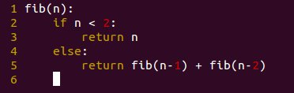
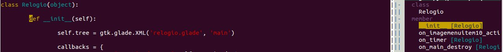
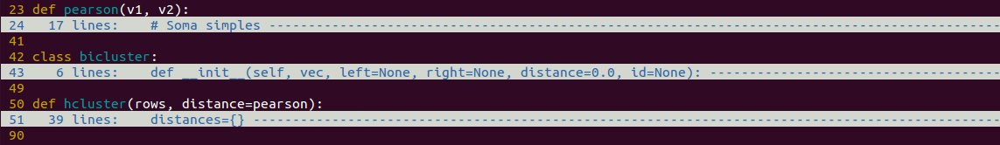

Qual programador não procura um ambiente de desenvolvimento que seja **simples**, **amigável** e **funcional**?

Muitos acabam voltando ao bloco de notas por sua **simplicidade**.

Neste post você vai explorar o Vim, um editor de texto que roda na linha de comando e é a paixão de muitos desenvolvedores.

Em um [post anterior](http://www.pythonize.org/programando-em-python-no-vim/ "Programando em Python no Vim") eu falei sobre como habilitar o auto-complete no vim pra código em python. Neste post vamos um pouco mais além nessas configurações

Recentemente encontrei um [post num blog](http://dancingpenguinsoflight.com/2009/02/python-and-vim-make-your-own-ide/) com dicas mostrando como tornar o vim numa IDE completa pra Python.

Testei algumas funcionalidades que tornaram o vim bem amigável pra programar e gerenciar código. Fiz todos os testes no Ubuntu, em outros sistemas Linux deve ser similar. Neste post vou passar essa experiência que tive configurando e usando o vim para criar código python.

Antes de tudo, instale os pacotes vim-full e vim-python se estiverem disponíveis nos repositórios do seu sistema. As configuração no vim são feitas num arquivo chamado vimrc, nas últimas versões do Ubuntu ele fica localizado na pasta /etc/vim e precisa ser root para modificá-lo.

### 1. Destaque de código no Vim

Para habilitar highlighting (destaque do código) no vim adicione a seguinte linha no arquivo vimrc:

    syntax on

No seu arquivo vimrc pode ser que esta linha venha comentada e acompanhada das seguintes linhas:

    if has("syntax")
        syntax on
    endif


Basta descomentar estas linhas que o highlighting ficará disponível.

### 2. Indentação de código

Como a indentação em Python é fundamental, sem ela podem ocorrer erros no código, uma ide que  tenha auto-indentação é ideal.  No arquivo vimrc procure as seguintes linhas e descomente ou adicione se elas já não estiverem no arquivo:

    " Habilita auto-indentação
    if has("autocmd")
      filetype plugin indent on
    endif


### 3. Número de linhas

Para exibir o número das linhas no vim adicione o seguinte no vimrc:

    " Habilitar numero de linhas
    set number

    " Alternar exibição de numero de linhas (facilita na hora de copiar)
    nnoremap  :set nonumber!: set foldcolumn=0

O resultado é este:



### 4. Navegação pelo código

Uma funcionalidade muito útil é a navegação pelo código. Com esta ferramenta habilitada é possível ver todas as classes e funções presentes no seu código e poder pular automaticamente pra qualquer uma delas.

Primeiro, é preciso instalar o pacote [exuberant-ctags](http://ctags.sourceforge.net/), disponível no repositório com este mesmo nome. Depois, baixe o [taglist](http://www.vim.org/scripts/script.php?script_id=273), que é um plugin do vim. Coloque o arquivo taglist.vim na pasta ~/.vim/plugin e o taglist.txt na pasta ~/.vim/doc, vá até esta última pasta, inicie o vim e rode :helptags. (com '.' no final) e já estará instalado.



Agora é preciso fazer algumas alterações no vimrc:

```bash
" Exibe nome da função
let g:ctags_statusline=1
" Inicializar script automaticamente
let generate_tags=1
" Exibe os resultados em uma janela vertical
let Tlist_Use_Horiz_Window=0
" Atalho para exibição da Taglist
nnoremap TT :TlistToggle
map  :TlistToggle
" Configurações para exibição da Taglist
let Tlist_Use_Right_Window = 1
let Tlist_Compact_Format = 1
let Tlist_Exit_OnlyWindow = 1
let Tlist_GainFocus_On_ToggleOpen = 1
let Tlist_File_Fold_Auto_Close = 1
```


A Taglist estará disponível através do atalho F4 ou digitando "TT" (dois 't' maiusculos) As últimas configurações servem para exibir uma janela vertical à direita mostrando a taglist e ganhar foco quando é chamada.

### 5. Ocultar Código

Quando o seu código começa a ter muitas funções e classes fica difícil ter uma visão geral do que está disponível no código. A maioria das IDE's possuem uma funcionalidade para ocultar parte do código e mostrar somente a assinatura ou definição de classes e funções.

No Vim isso é possível através de um [plugin](http://www.vim.org/scripts/script.php?script_id=1494). Para instalá-lo baixe o arquivo [neste link](http://www.vim.org/scripts/script.php?script_id=1494), crie uma pasta chamada ftplugin dentro da pasta ~/.vim e copie o plugin para a pasta ftplugin. A tecla 'F' (\<Shift\> + f) oculta ou exibe todo o código dentro de funções e classes, enquanto que a tecla 'f'' exibe ou oculta o código onde está o cursor.



### 6. Project Explorer

Essa é uma das principais funções de uma IDE: organizar seu projeto. No Vim é preciso instalar o plugin [NerdTree](http://www.vim.org/scripts/script.php?script_id=1658), que pode ser baixado [aqui](http://www.vim.org/scripts/script.php?script_id=1658). Para instalar basta extrair o conteudo do arquivo .zip na pasta \~/.vim. Rode  :helptags. (com '.' no final) e rode :help NERD\_tree.txt para ver o arquivo de ajuda. Pra utilizar o plugin digite :NERDTree e será aberta uma janela com o conteúdo da pasta atual.

Na [página de scripts](http://www.vim.org/scripts/index.php) do vim, você pode encontrar outros plugins de Python para o vim. Se você testar algum outro plugin ou tiver uma funcionalidade interessante que eu não comentei no post, deixe sua experiência nos comentários.
