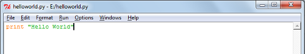
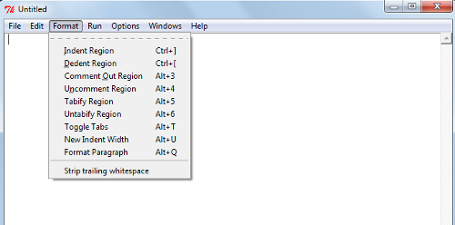

Depois da instalação do Python e alguns testes vamos pôr a mão na massa e trabalhar de verdade com arquivos de código. Todo código que você faz no interpretador é perdido quando você fecha o interpretador. Mas eu fiz muito código legal e vou simplesmente perder tudo? Python também trabalha com arquivos de código que você pode salvar em sua máquina para rodar depois.

Os arquivos Python têm extensão .py. É possível rodar um arquivo Python a partir da linha de comando da seguinte forma:

```bash
$ python nome_do_arquivo.py
```

Com isso todo o código que está salvo no arquivo é transformado em bytecode, que é um arquivo binário usado pelo interpretador. O bytecode é multiplataforma, ou seja, você pode levar seu código pra rodar em qualquer máquina e qualquer sistema. O bytecode é armazenado em sua máquina geralmente com a extensão .pyc, quando você executar seu código novamente sem alterações o programa não precisa ser compilado de novo, sendo executado mais rápido. Sempre que o seu código fonte é alterado, o interpretador gera um novo bytecode.

Você pode escrever seu código no tradicional bloco de notas, mas existem diversas alternativas para escrever código Python e eu recomendo fortemente que não seja escrito no bloco de notas. Existem vários editores de texto e IDEs próprias pra se escrever código em Python. No Windows temos o Notepad++ que tem highlighting (destaca palavras especiais e seu código em cores) ou o próprio IDLE que também vem com highlighting, auto-identação e outros recursos que facilitam a criação do código. No Linux tem o Vim, que possui todos esses recursos citados anteriormente ou o Kate. Você pode ver outros editores na [lista de editores Python](http://wiki.python.org/moin/PythonEditors) e também [IDEs que suportam Python](http://wiki.python.org/moin/IntegratedDevelopmentEnvironments).

Neste post vamos tratar do IDLE para Windows em outro post vou falar do Vim no Linux, se alguém tiver experiência com outros editores ou IDEs, por favor compartilhe conosco nos comentários.

**IDLE**

O IDLE, além de ter uma linha de comando Python, também é usado como editor de arquivo fonte. Com a janela principal do IDLE aberta vá ao menu File-&gt;New Window e será aberta uma janela em branco onde é possível escrever o código.

Vamos fazer um pequeno teste. Na nova janela aberta digite o código que está na imagem (print "Hello World"):



Salve o arquivo com o nome: helloworld.py

Você já pode perceber a função highlighting nesse código.

Nesta mesma janela, vá ao menu Run->Run Module ou aperte a tecla F5. Vai ser impresso o texto Hello World na tela do interpretador.

Vamos avançar um pouco mais. Escreva o seguinte trecho de código no IDLE:

```python
#-- coding: latin1 --
x = 7*3        #Isto é um comentário
y = "Hello"     #Este é mais um comentário
if y == "Hello":
x = x + 1
y = y + "World"    #Concatenação de strings
print x
print y
```

Aqui, mais uma função do IDLE: auto-identação, assim que você digita linha 4 e dá Enter, o IDLE identifica um novo bloco de código. O Python identifica blocos de código através da identação, diferente de outras linguagens como C e Java que identificam blocos entre chaves ({}).

Outras funções interessante estão no menu Format na janela de edição de código.



Neste menu você pode identar ou tirar identação de um trecho selecionado, é possível comentar ou descomentar o código, transformar tab em espaços ou vice-versa.

Dúvidas, opiniões, sugestões e experiências, postem nos comentários!
